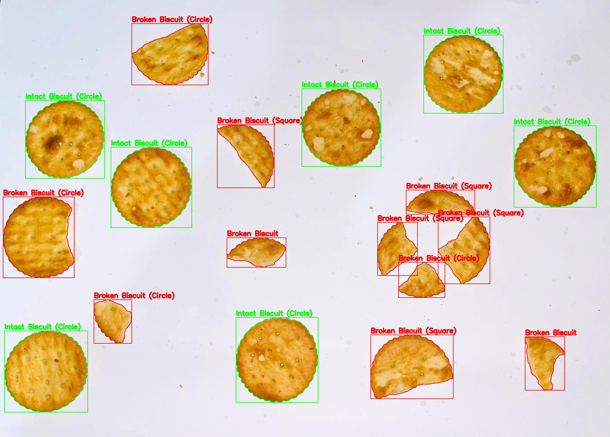

# Broken-Biscuit-Detection
# Broken Biscuit Detection using Classical Image Processing Techniques

## 📌 Project Description
In food industries, broken biscuits reduce product quality and customer satisfaction. Manually checking each biscuit is time-consuming and inefficient.  

This project provides an automated solution using classical image processing techniques to detect biscuits and classify them as **intact** or **broken**.  

The system also identifies the biscuit shape as:
- Circular (round biscuits)
- Square (crackers)

---

## 🛠️ Tools and Libraries Used

- Python
- OpenCV
- NumPy
- VS Code

---

## ⚙️ Image Processing Methods Used

The system uses classical image processing techniques:

### 🔹 Color Isolation (HSV)
- Images are converted to HSV colour space
- A colour range is used to detect biscuit regions

### 🔹 Morphological Operations
- Opening → removes small noise
- Closing → fills gaps in shapes

### 🔹 Contour Detection
- Detects individual biscuit shapes from the image

### 🔹 Shape Analysis
The following features are used:

- **Circularity** → Detect circular biscuits  
- **Vertices** → Identify corners  
- **Aspect Ratio** → Check square shape  
- **Extent** → Measure shape completeness  

## ▶️ How to Run

1. Install Python

2. Install required libraries:
pip install opencv-python numpy

3. Place images inside:
inputs/

4. Run the program:
python src/biscuit_detection.py

5. Output will be saved in:
output_images/

## 📷 Example Output

- 🟢 Green → Intact Biscuit  
- 🔴 Red → Broken Biscuit  

The system detects biscuits and classifies them based on shape features such as circularity and aspect ratio.
## 📷 Sample Output

**Figure: Detection result showing intact and broken circular biscuits**

